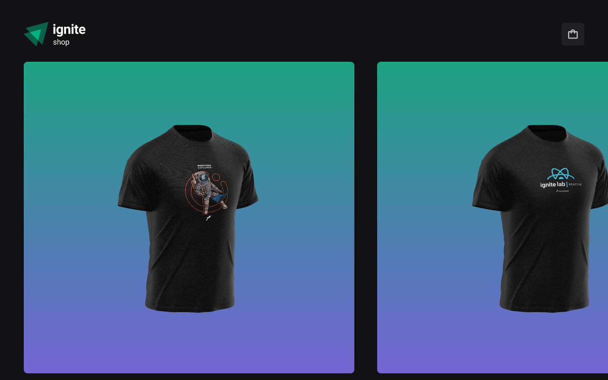

<h1 align="center">
    <a href="https://ignite-shop-wine-three.vercel.app/"> Ignite Shop </a>
</h1>

<p align="center"> Sua loja digital.. </p>

<h4 align="center"> 
	 Status:  Finalizado
</h4>




## 💻 Sobre:

O aplicativo que desenvolvI é uma loja de roupa fictício, de nome ignite shop.
Neste desafio foram abordados os seguintes temas:

- Next;
- Routes;
- components;
- Props;
- hooks;
- context;
---
## 🎨 Layout

## 🛠 Tecnologias

Este projeto foi desenvolvido com as seguintes tecnologias:

- Next
- Stitches
- Striper
- Radix
- Context API
- TypeScript
---


<br>
<br>

## 🚀 Como executar o projeto.

Este projeto é divido em uma parte:
1
💡O Backend deve estar rodando em sua máquina para que o frontend seja reenderizado.
)

### Pré-requisitos

Antes de começar, você vai precisar ter instalado em sua máquina as seguintes ferramentas:
[Git](https://git-scm.com), [Node.js](https://nodejs.org/en/). 
Além disto é bom ter um editor para trabalhar com o código como [VSCode](https://code.visualstudio.com/)

<br>

#### 🎲 Rodando a aplicação (Frontend) 

```bash

# Clone este repositório
$ https://github.com/danielqueirozc/Ignite-shop.git

# Acesse a pasta do projeto no terminal/cmd
$ cd + sua pasta + git clone git@github.com:danielqueirozc/Ignite-shop.git

# Instale as dependências com:
$ npm install

# Rode a aplicação em modo de desenvolvimento:
$ npm run dev

# O servidor inciará na porta:3000 - acesse <   localHost:3000
```
---


---
## Deploy do projeto.
https://ignite-shop-wine-three.vercel.app/
